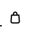
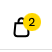
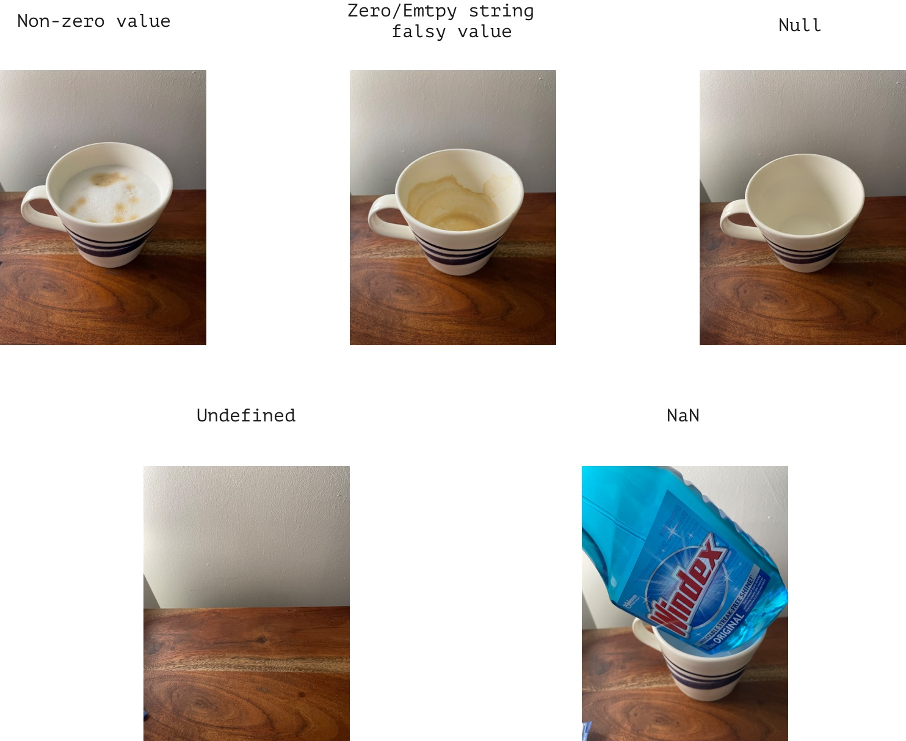

# Introduction to JavaScript

## Introduction

JavaScript is a powerful, modern, and beginner-friendly coding language. JavaScript helps make webpages interactive. For example, if you've put items in an online shopping cart, JavaScript works behind the scenes to do that action.


When learning something new, there are often a lot of little details to know before you can begin to do exciting things. This lesson will cover a fair number of essential things so you can start writing code quickly.

Coding is a skill, just like playing sports or music, reading about something only prepares you a little bit. The actual learning and skill-building happen by doing. You'll make many mistakes along the way, and that's ok! It's just code! You can always fix it and try again.

**Note**: JavaScript is a different language than Java, even though the names are similar. Java is to JavaScript as car is to carnival. JavaScript was originally called LiveScript, but changed its name to be more on trend with the naming styles of the time. [Read more on Wikipedia](https://en.wikipedia.org/wiki/JavaScript)

## Learning Objectives

- Define and use the basic syntax of code
- Define and implement the five most common primitive data types in JavaScript( numbers, strings, booleans, undefined, null).
- Implement and define standard JavaScript operators.
- Differentiate between different variable declaration keywords.
- Determine data types to variables with `typeof`
- Find more information

<hr>

## Getting started

You can read through this introduction or open an online coding tool like [repl.it](https://replit.com/~) to try out any examples.

### The characters of code

Syntax is the arrangement of words, phrases, and symbols to create a well-formed statement. Computers expect precision. You must use the correct characters in the proper order for the computer to execute the code you've written. If you don't write your code correctly, you will have a `syntax error`. Before your code can work at all, you must go back and correct the error.

JavaScript uses a lot of keyboard characters you have likely used sparingly.

Let's start with `forward slash` (or `slash`). Two slashes together let you add comments to your code:

```js
"This is some text";
// This is the text that has been commented out
```

Next, you will notice that many lines of code end with a `;` semi-colon. This is like a period at the end of a sentence. While you can write paragraphs without them, and people will mostly be able to understand you, it is often better practice to include them.

<details><summary>Open these details to see some common characters used in JavaScript,</summary>

|     name     | character |
| :----------: | :-------: |
| single quote |     '     |
| double quote |     "     |
|   backtick   |     `     |
|     plus     |     +     |
|    minus     |     -     |
|   multiply   |    \*     |
|    divide    |     /     |
|     pipe     |    \|     |
|    modulo    |     %     |
|  backslash   |    \      |
|  ampersand   |     &     |
| parenthesis  |    ()     |
|   brackets   |    []     |
| curly braces |    {}     |
|  semi-colon  |     ;     |
|    colon     |     :     |
|     not      |     !     |
|  underscore  |    \_     |

If you would like to use as simple app to help you practice learning the names for these different characters, you can try [this app](http://www.karolinrafalski.com/characters/) (only works in a desktop browser).

</details>

## Primitive Datatypes

There are many kinds of data types. There are numbers, words, lists, maps, tables, and more.

Each datatype has a specific utility. First, we will focus on primitive (simple) datatypes like words (strings) and numbers rather than more complex datatypes like lists or tables.

### Numbers

> **Note**: To try these simple examples, you can type on the right side of repl.it, where there is a prompt that starts with `>`. Later you can use the right side to store some code and then use the green `run` button.

To use a number, you can type it. Here is an integer:

<!-- prettier-ignore-start -->
```js
42;
```
<!-- prettier-ignore-end -->

You can create negative numbers:

<!-- prettier-ignore-start -->
```js
-42;
```
<!-- prettier-ignore-end -->

You can create floating point (decimals) numbers:

<!-- prettier-ignore-start -->
```js
42.22;
```
<!-- prettier-ignore-end -->

You can write out large numbers with an underscore to make them more easily readable:

<!-- prettier-ignore-start -->
```js
1_000_000;
// 1000000
```
<!-- prettier-ignore-end -->

You can perform simple mathematical operations:

<!-- prettier-ignore-start -->
```js
2 + 2;
// 4
```

And complex ones:
<!-- prettier-ignore-start -->
```js
10 * (100 / 5) + 20 - 178 ** 1;
// 42
```

You can also determine the remainder by using modulo:
<!-- prettier-ignore-start -->
```js
5 % 2;
// 1
```
<!-- prettier-ignore-end -->

If you try to perform an invalid mathematical operation, JavaScript will return a value called `NaN` (Not a Number).

<!-- prettier-ignore-start -->
```js
"puppies" * 5;
// NaN
```
<!-- prettier-ignore-end -->

Here is a real-world example where the code for the MTA had a bug:


### Strings

Strings are usually used for words and sentences. They must be wrapped in quotes. You can use single quotes:

<!-- prettier-ignore-start -->
```js
'Hello, world!';
```
<!-- prettier-ignore-end -->

Or double quotes:

```js
"Hello, world!";
```

You can add two strings together. This is called `string concatenation`.

<!-- prettier-ignore-start -->
```js
"Hello," + " world!";
```
<!-- prettier-ignore-end -->

You can also interpolate strings. This one is typically the easiest to read, but it is also the most tricky to learn because you must use a character called a `backtick` and use matching `curly braces` `{}` with a dollar sign `$` in front. The backtick is a character usually on the upper right of your keyboard and shares the key with the tilde `~`.

<!-- prettier-ignore-start -->
```js
`Hello, ${"world"}!`;
```
<!-- prettier-ignore-end -->

### Booleans

Booleans only have two possible values: `true` or `false`.

Using true and false values is essential for nearly all coding logic. For example, if you are looking at a typical webpage with a shopping cart, if the cart is empty is true, then you will only see a plain icon. But if the cart is not empty (false), it will show the number of items on top of the icon.

If the shopping cart empty is true, show the shopping bag icon:



If the shopping cart is not empty, show a yellow dot with the number of items inside:



The words `true` and `false` are special keywords (also known as [reserved words](https://www.w3schools.com/js/js_reserved.asp)) and do not need quotes around them.

```js
> true
> false
```

Boolean logic is often used for control flow: the decision of whether to execute a block of code.

A code block is usually denoted by curly braces `{}`. To let the computer make a decision, you can use the keyword `if`:

```js
if (true) {
  // do something
}
```

The `do something` will only happen `if` the value inside the parenthesis evaluates to `true`. Else, it will skip the code block and move on.

### Undefined

`undefined` is another keyword. This one tends to come up when a value has not been set yet. Or, there is a mistake in the code, and there is supposed to be a value, but there isn't.

### Null

Similar to `undefined` null is the absence of data. However, `null` is typically used when you want to be clear that there is no value.

For example, when filling out a form, there may be inputs for a home phone number and a cellphone number. But if someone has just one number for both, the value of `null` would help explain that there is no value on purpose for the home phone number, rather than if someone forgot to fill out the field.

Here is a visual that may help you understand the different values possible using a cup with (or without) coffee.



## Variables

To build a complex program, one must have a way to store values and use them later.

For example, earlier you used the number 42. But once the line of code was executed, that number was gone.

To hold onto values, you will use a `variable`. You can name variables with any combination of letters and add numbers to the end. You can also use a limited number of characters like `$` or `_`.

Variables must be declared. To declare a variable you must use one of three reserved keywords. Then you assign the value by using an equal sign.

- `var` - This is the old (previous to 2015) way to declare a variable in JavaScript. Almost no one uses this anymore, but you will likely see code examples on your learning journey that use this.
- `const` - short for constant, the value is not expected to change while the program runs.
- `let` - the value is expected to possibly change while the program runs.

```js
const myString = `my string`;
let myNumber = 42;
let myBoolean = true;
```

> **Note**: when words do not have quotes, they are considered variables by the computer. It's a common mistake to forget to wrap your strings in quotes.

> **Note**: In JavaScript, the preferred style for variable names is camelCase. That means if you have a variable made up of two or more words, the first letter is lowercase, and then the first letter of the next word is capitalized.

### Console.log

In any programming language, it's essential to see some output of what you have written.

With JavaScript, the way you can see the output is to use `console.log()`. You put whatever output you want to see inside the parenthesis.

```js
console.log("Hello, world!");
```

You can see your variable's value by using `console.log`.

```js
console.log(myString);
console.log(myNumber);
console.log(myBoolean);
```

## Using variables

You can use variables just like any of the data types.

### Strings

You can concatenate or interpolate them:

```js
console.log("The value of my string is " + mystring + "!");
// "The value of my string is my string!"
console.log(`The value of my string is ${mystring}!`);
// "The value of my string is my string!"
```

## Numbers

You can operate on them:

```js
let myNumber = 42;

console.log(myNumber * 2);
// 84
```

You can also can add to the values and update the variable value:

```js
myNumber = myNumber + 1;
console.log(myNumber);
// 43
```

You can write adding a value of one with this shorter syntax:

```js
myNumber++;
console.log(myNumber);
// 43
```

You can change the value by more than one:

```js
myNumber = myNumber - 7;
console.log(myNumber);
// 36
```

You can also change the value with this shorter syntax:

```js
myNumber -= 7;
console.log(myNumber);
// 29
```

You can compare values by using the following:

|        comparison        | symbols |
| :----------------------: | :-----: |
|       greater than       |    >    |
| greater than or equal to |   >=    |
|        less than         |    <    |
|  less than or equal to   |   <=    |
|    equal to (strict)     |   ===   |
|         equal to         |   ===   |
|  not equal to (strict)   |   !==   |
|       not equal to       |   !=    |

Strict checking makes sure that the type is the same.

The string "42" is not strictly equal to the number 42:

```js
"42" === 42;
// false
```

However, it is loosely equal, which can be checked with two equal signs instead of three:

```js
"42" == 42;
// true
```

Generally, it is best to use the strictest type of checking and only loosen it when there is use-case that makes sense.

Here are some more comparisons in action:

```js
console.log(myNumber > 5);
console.log(myNumber === 42);
console.log(myNumber <= 100);
console.log(myNumber !== "42");
```

### Booleans

You can reverse the value of a boolean by using the `not` operator:

```js
console.log(!myBoolan);
```

## Typeof

Once you've declared some variables, it is easy to forget what data type they might be. You can use the keyword `typeof` to find out.

```js
console.log(typeof myString);
console.log(typeof myNumber);
console.log(typeof myBoolean);
```

## Finding more information and learning as you go

This lesson has covered some basics. It has not covered everything, even within the topics covered. A lesson that would cover everything would be very long and tedious, and you'd likely not need most of the content daily, and you would probably forget most of it.

A lot of deeper learning with coding comes from trying different things and experimenting on your own. If you have a question like `is NaN equal to NaN`? You can look it up, and there will likely be an in-depth explanation. It may or may not make sense to you. But you can also open up a JavaScript console and try it and see what happens, and in doing so, you will likely gain some more insight into the rules of coding.

Being a developer means taking what you know and building upon it to solve whatever challenges you face. You don't need to memorize everything. You just need to know enough to look up what you need and keep trying until it works. Coders are inaccurately portrayed in the media as fast-typing geniuses who already know everything.

Day-to-day coding involves a lot of reading, researching, trying things, fixing syntax errors, wondering why something doesn't work, getting up and taking a break, reading, trying other things, wondering why something does indeed work, and hopefully getting a few wins for the day. Coders in the real world are steady, hard-working individuals with a lot of grit.

With that, there are a few must-have JavaScript resources that will help you along your coding journey:

- [MDN - Mozilla Developer Network](https://developer.mozilla.org/en-US/docs/Web/JavaScript) - An online resource to help you look up syntax and explanations. For example, here is a reference of [operators](https://developer.mozilla.org/en-US/docs/Web/JavaScript/Reference/Operators).
- [W3 Schools](https://www.w3schools.com/js/default.asp) - Another online resource that has the same information but is organized and explained differently. Compare [operators](https://www.w3schools.com/js/js_operators.asp).
- [Free Code Camp](https://www.freecodecamp.org) - An online learning resource that let's you learn, practice and have your code checked.
- [Eloquent JavaScript](https://eloquentjavascript.net) is a popular free online textbook where you can code along. This resource can be very helpful for reading a second explanation of a challenging concept.
  - So far, we have covered much of the information in [Chapter 1](https://eloquentjavascript.net/01_values.html) and the first three sections of [Chapter 2](https://eloquentjavascript.net/02_program_structure.html)
