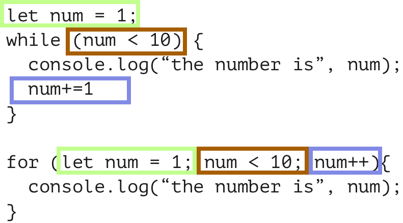

# Loops

## Introduction

What happens if you were tasked to write a program that prints out the numbers from 1 - 1000? You could do it like this.

```js
console.log("The number is: ", 1);
console.log("The number is: ", 2);
console.log("The number is: ", 3);
console.log("The number is: ", 4);
console.log("The number is: ", 5);
// etc.
```

Would you be excited about writing 1000 lines of code like this? Technically, this code is fine and works as expected. But this task seems so tedious. You are likely thinking "there must be a better way." Programmers delight when they can work smarter rather than harder and write their code more efficiently and elegantly. Programmers generally do not enjoy copy-pasting code repeatedly and making minor tweaks for hours or days on end.

Just because coders like to make more efficient and elegant code doesn't mean that that is how their code starts out. When starting out, writing a short bit of elegant code might take longer than copying and pasting. When you look at a solution that is short, clear and elegant it is usually a sign of a lot of thought, effort and skill.

Making your code DRY(er) (Don't Repeat Yourself) takes practice. Often you'll start by copy-paste and tweaking it. Then when you're starting to see the patterns, you can upgrade your code to something more DRY, which is a good way to do things! If you try to code the perfect solution first, you will likely feel overwhelmed, get stuck, and possibly code solutions to problems you will never have. Therefore, taking smaller steps is the better way to get the code to be how you like.

> First, do it.

> Then do it right.

> Then do it better!

- Addy Osmani

Programmers have loops in their coding toolbox to help handle making long boring programs that would otherwise require a lot of cutting and pasting, shorter, more flexible, and more maintainable.

## Learning Objectives

- Explain the purpose and utility of loops
- Write a `while` loop with a variable number of iterations.
- Write a `for` loop with a variable number of iterations.
- Use the `break` and `continue` keywords to modify loop execution.

<hr>

## The `while` loop

Now that we know why loops can be a good idea let's write our first **while** loop. A **while** loop is similar to an **if** statement in that we will check if some condition is true. Unlike an **if** statement, we will execute the code block following the while loop, again and again, **as long as the condition is true**. Whenever we reach the bottom of the code block, we back up and check the condition again.

```js
let num = 1;
while (num <= 10) {
  console.log("the number is: " + num);
}
```

If you try to run the code above, the number `1` will be logged repeatedly. Eventually, your computer will freeze, or you will see an error message. This is because we continually check if the value of `num` is smaller than 10. If it is smaller, we log the value of `num` and check again. Since the value of `num` never changes, we keep logging `1` until the computer runs out of memory. This is called an _infinite loop_.

To fix this, we need to change the value of `num` inside the code block. In this instance, we will increase the value by `1` every time.

```js
let num = 1;
while (num <= 10) {
  console.log("the number is: " + num);
  num += 1;
}
```

It works! Run the program, and you will see that the numbers 1 to 10 are logged to the screen. But what if we want to log only odd numbers? In that case, we'd need to increase num by `2` every time.

```js
let num = 1;
while (num < 10) {
  console.log("the number is: " + num);
  num += 2;
}
```

- Ex 1. Write a `while` loop that logs all the even numbers between 0 and 100.

> Bonus: Can you do it while only incrementing num by one each time?
> **Hint**: Can the `%` operator help you here?

 <details>
 <summary>
 Solution
 </summary>

```js
let num = 0;
while (num <= 100) {
  if (num % 2 === 0) {
    console.log(num);
  }
  num++;
}
```

 </details>

- Ex 2. Write a `while` loop that logs all the odd numbers starting from 99 and going down to 1.

 <details>
 <summary>
 Solution
 </summary>

```js
let num = 100;
while (num > 0) {
  if (num % 2 === 1) {
    console.log(num);
  }
  num--;
}
```

 </details>

## The `for` loop

Another kind of loop, the `for` loop, is a similar to a condensed version of a while loop. With the `for` loop, we create a variable, check a condition, and change the variable's value in one line. This improves readability and maintainability.

```js
for (let num = 1; num < 10; num += 1) {
  console.log(num);
}
```

The above loop logs the numbers between 1 and 10, just like the while loop above. It works the same as the previous while loop, but the components of the loop are all maintained on the same line, making it easier to read and update.

Generally speaking, the structure of the `for` is the same every time. Two semicolons separate the three parts of the code.

- The part before the first semicolon defines a variable.
- The second part is a boolean expression that checks if the loop should continue (This section is most similar to our `while` loops).
- The last part updates the variable we created after every iteration.



- Is `num +=1` the same as `num++`? Can you think of a time you would use one instead of the other?

More formally, this is what each part is called:

```js
for ([initialization]; [end condition]; [increment / step]) {}
```

## Using loops to solve complex problems

Loops can be used to solve pretty complex problems. Earlier, we changed the increment from `1` to `2` when we wanted to log only even or only odd values. But what if we count both even and odd numbers and do something different for each?

Let's say we want to log for each number: `'even'` if it is even, and `'odd'` if it is odd. We can use the modulo (remainder) operator for this problem: `%`. We will make a loop that increments a variable by `1`, and inside the code, block check if the variable is even or odd. To do this, we check to see if the remainder of the number divided by 2 equals 0. The number is even if there is no remainder (the remainder is 0). Otherwise, the number is odd.

It is a standard convention to name the iterating variable i.

```js
for (let i = 0; i <= 10; i++) {
  if (i % 2 === 0) {
    console.log(i + " is even");
  } else {
    console.log(i + " is odd");
  }
}
```

When you run this program, you will see the following:

```
0 is even
1 is odd
2 is even
...
9 is odd
10 is even
```

We can also use a loop to calculate the sum of all the numbers between 1 and 10:

```js
let sum = 0;
for (let i = 1; i <= 10; i++) {
  sum += i;
}
```

We can write a chart to see what's going on more closely:

|  i  | sum |
| :-: | :-: |
|  1  |  1  |
|  2  |  3  |
|  3  |  6  |
|  4  | 10  |
|  5  | 15  |
|  6  | 21  |
|  7  | 28  |
|  8  | 36  |
|  9  | 45  |
| 10  | 55  |

You may have noticed that to find the value of `sum` in every new row, we take the current value of sum and add it to the value of `i` in the next row. It is often helpful to write things out this way. It can help clear things up.

## Changing the increment in loops

So far, we've been incrementing a variable by `1` on each loop iteration. We can increment by other numbers as well.

```js
// logging all multiples of 5 between 5 and 50
for (let i = 5; i <= 50; i += 5) {
  console.log(i);
}
```

We can also decrement instead of incrementing:

```js
// logging all multiples of 5 between 50 and 5, descending
for (let i = 50; i >= 5; i -= 5) {
  console.log(i);
}
```

- Ex. Log all multiples of 10 between 10 and 100
<details>
<summary>
Solution
</summary>

```js
for (let i = 10; i <= 100; i += 10) {
  console.log(i);
}
```

 </details>

- Ex. Log all multiples of 10 between 100 and 0, descending
<details>
<summary>
Solution
</summary>

Did you write your own first?

 <details>
 <summary>
  Yes
 </summary>

for(let i = 100; i >= 0; i -= 10) {
console.log(i)
}

 </details>

 <details>
 <summary>
  No
 </summary>
 **Go do it**
 </details>
 </details>

# `break` and `continue`

### `break`

Sometimes, we want to stop a loop when a certain condition is met. For example, let's say that we want to count over a range of numbers and stop once we get to five:

```js
for (i = 0; i < 10; i++) {
  if (i === 5) {
    break;
  }
  console.log(`I am looking at the number ${i}`);
}
```

This will log the following to the console:

```
I am looking at the number 0
I am looking at the number 1
I am looking at the number 2
I am looking at the number 3
I am looking at the number 4
```

As soon as `i` equals 5, we immediately stop and don't execute the rest of the loop.

### `continue`

Alternatively, we might hit a condition where we want to ignore the rest of the code inside the body of the loop but continue incrementing our iterator to its next value:

```js
for (i = 0; i < 10; i++) {
  if (i === 5) {
    continue;
  }
  console.log(`I am looking at the number ${i}`);
}
```

This will log the following to the console:

```
I am looking at the number 0
I am looking at the number 1
I am looking at the number 2
I am looking at the number 3
I am looking at the number 4
I am looking at the number 6
I am looking at the number 7
I am looking at the number 8
I am looking at the number 9
```

Note that we skip the line where it would log "I am looking at the number 5" because we `continue` in the line above it.
